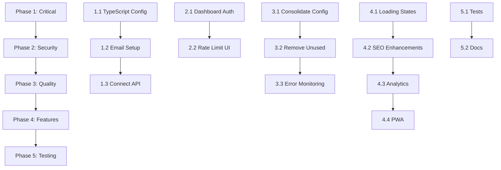

# AGSEO.pro - Comprehensive Fix Plan

## Executive Summary

This plan addresses all critical issues identified in the codebase audit and adds missing functionalities to make agseo.pro production-ready.

---

## Phase 1: Critical Fixes (Week 1)

### 1.1 Enable Strict TypeScript Configuration

**Files to Modify:** [`tsconfig.json`](tsconfig.json), [`tsconfig.app.json`](tsconfig.app.json)

**Changes:**
```json
{
  "compilerOptions": {
    "noImplicitAny": true,
    "strictNullChecks": true,
    "noUnusedLocals": true,
    "noUnusedParameters": true,
    "strict": true,
    "noFallthroughCasesInSwitch": true,
    "noImplicitReturns": true
  }
}
```

**Expected Outcome:** Better type safety, fewer runtime errors

**Effort:** Low | **Risk:** Low | **Priority:** HIGH

---

### 1.2 Configure Email Notifications (RESEND)

**Files to Modify:** `.env` (create from `.env.example`)

**Required Environment Variables:**
```env
# Email Service (Resend)
RESEND_API_KEY=re_123456789
RESEND_FROM_EMAIL=hello@agseo.pro
LEADS_TO_EMAIL=business@agseo.pro

# Supabase (for edge functions)
SUPABASE_URL=https://your-project.supabase.co
SUPABASE_SERVICE_ROLE_KEY=your-service-role-key
ALLOWED_ORIGINS=https://agseo.pro,https://www.agseo.pro

# Rate Limiting
CONTACT_RATE_LIMIT_MAX=8
CONTACT_RATE_LIMIT_WINDOW_SECONDS=600
```

**Expected Outcome:** Email notifications work for contact form submissions

**Effort:** Low | **Risk:** Low | **Priority:** HIGH

---

### 1.3 Connect Frontend to Supabase API

**Files to Modify:** [`src/lib/api.ts`](src/lib/api.ts)

**Current State:**
- Frontend uses Firebase Firestore
- Supabase Edge Function exists at `/api/contact` but not connected

**Solution - Two Options:**

**Option A: Use Supabase Edge Function (Recommended)**
```typescript
// Update src/lib/api.ts to call /api/contact
contact: {
  submit: async (data: ContactSubmission): Promise<ContactSubmissionResult> => {
    const response = await fetch('/api/contact', {
      method: 'POST',
      headers: { 'Content-Type': 'application/json' },
      body: JSON.stringify(data)
    });
    return response.json();
  }
}
```

**Option B: Add Email to Firebase Function**
- Deploy a Firebase Cloud Function to send emails via Resend

**Expected Outcome:** Unified API with email notifications

**Effort:** Medium | **Risk:** Low | **Priority:** HIGH

---

## Phase 2: Security & Authentication (Week 2)

### 2.1 Protect Dashboard Route

**Files to Modify:** [`src/components/layout/AnimatedRoutes.tsx`](src/components/layout/AnimatedRoutes.tsx), create new auth components

**Implementation:**
```typescript
// Create useAuth hook
// Create ProtectedRoute component
// Wrap /dashboard route with authentication check
```

**Components Needed:**
1. `src/hooks/use-auth.ts` - Authentication state management
2. `src/components/auth/ProtectedRoute.tsx` - Route guard
3. `src/pages/Login.tsx` - Login page

**Firebase Auth Setup:**
```typescript
import { getAuth, signInWithEmailAndPassword, signOut } from 'firebase/auth';

const auth = getAuth(app);

export const login = (email: string, password: string) => 
  signInWithEmailAndPassword(auth, email, password);

export const logout = () => signOut(auth);
```

**Expected Outcome:** Dashboard accessible only to authenticated users

**Effort:** Medium | **Risk:** Medium | **Priority:** HIGH

---

### 2.2 Add Rate Limiting UI Feedback

**Files to Modify:** [`src/hooks/use-contact-form.ts`](src/hooks/use-contact-form.ts)

**Enhancement:**
- Show rate limit warning when user submits too many forms
- Display countdown timer for cooldown period

**Expected Outcome:** Better user experience during rate limiting

**Effort:** Low | **Risk:** Low | **Priority:** MEDIUM

---

## Phase 3: Code Quality & Performance (Week 2-3)

### 3.1 Consolidate Configuration

**Files to Modify:** Create [`src/lib/constants.ts`](src/lib/constants.ts)

**Current Problem:**
- Site URL in `siteMetadata.ts`
- Site URL in `config.ts`
- Site URL in `.env`

**Solution:**
```typescript
// src/lib/constants.ts
export const SITE_CONFIG = {
  baseUrl: import.meta.env.VITE_SITE_URL || 'https://agseo.pro',
  name: 'AGSEO',
  // ... other config
} as const;
```

**Expected Outcome:** Single source of truth for site configuration

**Effort:** Low | **Risk:** Low | **Priority:** MEDIUM

---

### 3.2 Remove Unused Dependencies

**Files to Modify:** [`package.json`](package.json)

**Check and Remove:**
- `next-themes` - Not using Next.js
- Verify all `@radix-ui` components are actually used

**Command to analyze:**
```bash
npm run build 2>&1 | grep -i "warning.*not used"
```

**Expected Outcome:** Smaller bundle size, faster builds

**Effort:** Low | **Risk:** Low | **Priority:** LOW

---

### 3.3 Add Error Monitoring

**Files to Modify:** [`src/sentry.ts`](src/sentry.ts)

**Current State:** Sentry configured but DSN may not be set

**Enhancement:**
```typescript
import * as Sentry from "@sentry/react";

Sentry.init({
  dsn: import.meta.env.VITE_SENTRY_DSN,
  environment: import.meta.env.MODE,
  integrations: [
    Sentry.browserTracingIntegration(),
    Sentry.replayIntegration(),
  ],
  tracesSampleRate: 1.0,
  replaysSessionSampleRate: 0.1,
});
```

**Expected Outcome:** Production error tracking

**Effort:** Low | **Risk:** Low | **Priority:** MEDIUM

---

## Phase 4: Feature Enhancements (Week 3-4)

### 4.1 Add Loading States & Skeleton Screens

**Files to Modify:** Various components in [`src/components/`](src/components/)

**Enhancements:**
1. Add Skeleton components for:
   - Blog post list
   - Pricing cards
   - Comparison tables
   - Glossary terms

2. Add button loading states:
   - Contact form submit button
   - Newsletter signup
   - Audit request form

**Expected Outcome:** Better perceived performance

**Effort:** Medium | **Risk:** Low | **Priority:** MEDIUM

---

### 4.2 Implement SEO Enhancements

**Files to Modify:** Various pages in [`src/pages/`](src/pages/)

**Add:**
1. **Schema.org Structured Data** (JSON-LD) for:
   - Organization
   - LocalBusiness
   - FAQPage
   - WebSite with SearchAction

2. **Dynamic Meta Tags** for:
   - Blog posts
   - Case studies
   - Comparison pages

3. **XML Image Sitemap** - Separate sitemap for images

**Example Schema:**
```typescript
const organizationSchema = {
  "@context": "https://schema.org",
  "@type": "Organization",
  "name": "AGSEO",
  "url": "https://agseo.pro",
  "logo": "https://agseo.pro/logo.png",
  "contactPoint": {
    "@type": "ContactPoint",
    "telephone": "+1-555-000-0000",
    "contactType": "customer service"
  }
};
```

**Expected Outcome:** Better search engine understanding, rich snippets

**Effort:** Medium | **Risk:** Low | **Priority:** MEDIUM

---

### 4.3 Add Analytics & Conversion Tracking

**Files to Modify:** [`src/lib/analytics.ts`](src/lib/analytics.ts), various components

**Enhanced Tracking:**
1. **Form Submission Events**
   - `form_start` - User starts filling form
   - `form_submit` - User submits form
   - `form_error` - Form submission fails
   - `form_success` - Form submission succeeds

2. **Conversion Events**
   - `cta_click` - Any CTA button click
   - `page_view` - Already implemented

3. **Scroll Depth Tracking**
   - Track 25%, 50%, 75%, 100% scroll

**Expected Outcome:** Better understanding of user behavior

**Effort:** Medium | **Risk:** Low | **Priority:** MEDIUM

---

### 4.4 Improve PWA Functionality

**Files to Modify:** [`vite.config.ts`](vite.config.ts), [`public/manifest.json`](public/manifest.json)

**Enhancements:**
1. Add offline page
2. Add install prompt
3. Add push notification support
4. Improve caching strategy

**Expected Outcome:** Better PWA experience

**Effort:** Medium | **Risk:** Low | **Priority:** LOW

---

## Phase 5: Testing & Documentation (Week 4)

### 5.1 Add Unit & Integration Tests

**Files to Create:** [`src/**/*.test.ts`](src/), [`src/**/*.test.tsx`](src/)

**Priority Test Coverage:**
1. Form validation (Zod schemas)
2. Contact form submission
3. Utility functions
4. Component rendering

**Testing Stack:**
- Vitest (already configured)
- React Testing Library
- MSW for API mocking

**Expected Outcome:** Confidence in code changes

**Effort:** High | **Risk:** Low | **Priority:** MEDIUM

---

### 5.2 Create Documentation

**Files to Create:** `docs/`

**Documentation Needed:**
1. `README.md` - Project setup & commands
2. `CONTRIBUTING.md` - Contribution guidelines
3. `ENVIRONMENT.md` - Environment variables guide
4. `DEPLOYMENT.md` - Deployment instructions

**Expected Outcome:** Easier onboarding for developers

**Effort:** Low | **Risk:** None | **Priority:** LOW

---

## Implementation Order



---

## Success Metrics

After implementing all fixes:

| Metric | Current | Target |
|--------|---------|--------|
| TypeScript Errors | ~50+ | 0 |
| Bundle Size | TBD | <500KB gzipped |
| Lighthouse Score | TBD | >90 |
| Form Submission Success | Partial | 100% with email |
| Dashboard Security | Unprotected | Auth required |
| Email Notifications | Not working | Working |
| Test Coverage | 0% | >60% |

---

## Risks & Mitigation

| Risk | Impact | Mitigation |
|------|--------|------------|
| Breaking changes during TypeScript fix | High | Run full test suite after changes |
| Email delivery issues | Medium | Use fallback to Firebase Functions |
| Auth implementation complexity | Medium | Use Firebase Auth (already integrated) |
| PWA conflicts with SSR | Low | Test thoroughly on multiple devices |

---

## Resources Needed

1. **Resend Account** - For email notifications
2. **Supabase Project** - Already exists, need keys
3. **Firebase Auth** - Already configured, need to enable
4. **Sentry Account** - Free tier sufficient

---

## Next Steps

1. **Immediate:** Configure `.env` with RESEND and Supabase keys
2. **This Week:** Enable strict TypeScript, connect API
3. **Next Week:** Add authentication to dashboard
4. **Week 3:** SEO enhancements and analytics
5. **Week 4:** Testing and documentation

---

*Plan created: 2026-02-26*
*Last updated: 2026-02-26*
